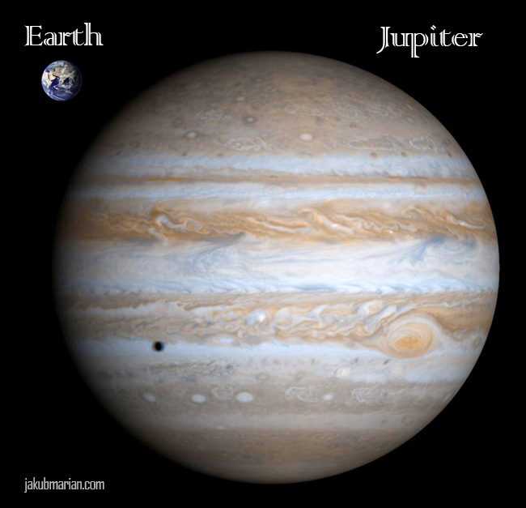

# Hello World
-------------

A basic _markdown_ dowcument that illustrates my vision:

1. Keep America strong
2. Feed America's families
3. Put education first

You can use $\LaTeX$, if that's your bag:
$$e^{i\pi} -1 = 0$$

```python
# Some python code
print("Python says hi", 2**8)

foo='broadsword'[1:6]
print(foo)
{{foo}}
```



